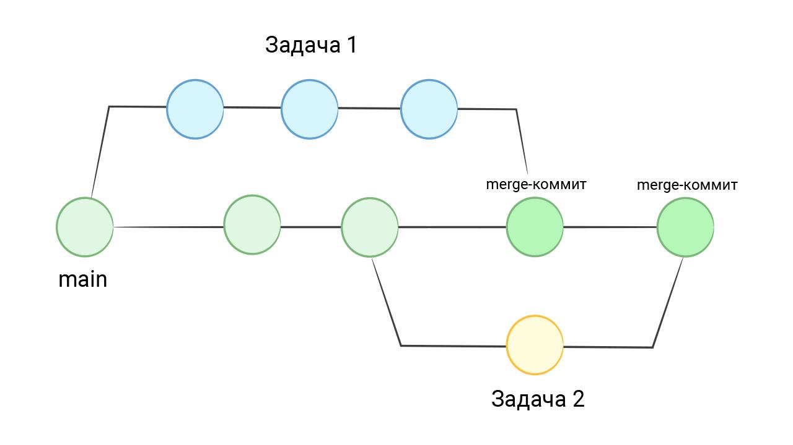

Для начала давайте выведем коммиты нашего проекта hexlet-git в специальном виде, который активируется опцией ```--graph```:
```bash
git log --graph

# Неполный вывод, чтобы не отвлекаться от сути
* commit e7bb5e51f96e572084f6c04ba3312e32ce6b8c0f (HEAD -> main, origin/main, origin/HEAD)
|
|     update README.md
|
* commit 65a8ef7fd56c7356dcee35c2d05b4400f4467ca8
|
|     Revert "remove PEOPLE.md"
|
|     This reverts commit aa600a43cb164408e4ad87d216bc679d097f1a6c.
|
* commit 5120bea3e5528c29f8d1da43731cbe895892eb6d
|
|     add new content
|
* commit e6f625cf8433c8b1f1aaed58cd2b437ec8a60f27
|
|     add INFO.md
|
* commit 273f81cf2117044f1973ea80ce1067a94bea3f80
|
|     remove NEW.md
```

Обратите внимание на полоску слева. Она отражает связи между коммитами. Каждый новый коммит базируется на коде предыдущего коммита. С точки зрения информатики коммиты выстраиваются в так называемый **односвязный список**. В таком списке каждый элемент ссылается на предыдущий. Последний элемент при этом называется **головой списка** (head по-английски).

В Git элементы списка — это сами коммиты. Как и в односвязном списке, новый коммит — это элемент, который имеет ссылку на предыдущий коммит. Предыдущий коммит ссылается на свой предыдущий, и так далее до первого коммита, который никуда не ссылается.

Понятие «голова списка» (HEAD) в Git присутствует явно и активно используется для разных операций. Например, удаление последнего коммита выглядит так:
```bash
# HEAD~1 означает: взять голову и удалить один коммит, начиная от нее
# То есть мы удаляем только последний коммит
git reset --hard HEAD~1
```

Сам список коммитов тоже имеет название. Вы его уже видели — это **main**. В терминологии Git такой список называется веткой (**branch**). Именно поэтому команда для показа текущего местоположения в истории называется ```git branch```:
```bash
git branch

* main
```
Строго говоря, ветка в Git — это просто подвижный указатель на один из коммитов. При каждом новом коммите указатель сдвигается вперед автоматически.

Основная работа Git — формировать односвязный список из коммитов. Подавляющее большинство команд Git — это всего лишь небольшие программы, которые умеют ходить по этому списку и извлекать нужную информацию. Фактически все сводится к тому, что мы блуждаем по этому списку, меняем его и добавляем новые коммиты.

## Ветки
Если смотреть дальше, то мы увидим, что цепочка коммитов в Git это не просто односвязный список. Это ***направленный ациклический граф*** — множество односвязных списков, переплетенных вместе.

Представьте себе, что в один момент два разных человека должны делать какие-то длинные задачи, требующие нескольких дней разработки или даже больше. В таком случае main-ветка должна оставаться рабочей: коммитить промежуточные изменения в нее нельзя, так как изменения могут сломать код. Но коммитить все равно надо, потому что просто небезопасно копить изменения в рабочей директории, не отправляя их в Git. Что делать в такой ситуации?

Гит позволяет отпочковаться от основного списка — сформировать ветку. То есть создается отдельный список коммитов, который идет мимо главной ветки. В конце разработки все коммиты из такой ветки вливаются обратно в main-ветку:

## Работа с ветками
Есть master (публичная версия сайта), выполняем масштабную задачу (переверстать «шапку»), но по ходу работ возникает необходимость подправить критичный баг (неправильно указан контакт в «подвале»).
```bash
# указана последовательность действий:
git checkout -b new-page-header # создадим новую ветку для задачи изменения «шапки» и перейдём в неё
subl inc/header.html            # редактируем разметку «шапки»
git commit -a -m "Новая шапка: смена логотипа" # делаем коммит (работа еще не завершена)
# тут выясняется, что есть баг с контактом в «подвале»
git checkout master             # возвращаемся к ветке master
subl inc/footer.html            # устраняем баг и сохраняем разметку «подвала»
git commit -a -m "Исправление контакта в подвале" # делаем коммит
git push                        # отправляем коммит с быстрым критическим изменением в master в удалённом репозитории
git checkout new-page-header    # переключаемся обратно в ветку new-page-header для продолжения работ над «шапкой»
subl inc/header.html            # редактируем и сохраняем разметку «шапки»
git commit -a -m "Новая шапка: смена навигации" # делаем коммит (работа над «шапкой» завершена)
git checkout master             # переключаемся в ветку master
git merge new-page-header       # вливаем в master изменения из ветки new-page-header
git branch -d new-page-header   # удаляем ветку new_page_header
```
## Работа с ветками, конфликт слияния
Есть ветка master (публичная версия сайта), в двух параллельных ветках (branch-1 и branch-2) было отредактировано одно и то же место одного и того же файла, первую ветку (branch-1) влили в master, попытка влить вторую вызывает конфликт.
```bash
# указана последовательность действий:
git checkout master           # переключаемся на ветку master
git checkout -b branch-1      # создаём ветку branch-1, основанную на ветке master
subl .                        # редактируем и сохраняем файлы
git commit -a -m "Правка 1"   # коммитим
git checkout master           # возвращаемся к ветке master
git checkout -b branch-2      # создаём ветку branch-2, основанную на ветке master
subl .                        # редактируем и сохраняем файлы
git commit -a -m "Правка 2"   # коммитим
git checkout master           # возвращаемся к ветке master
git merge branch-1            # вливаем изменения из ветки branch-1 в текущую ветку (master), удача (автослияние)
git merge branch-2            # вливаем изменения из ветки branch-2 в текущую ветку (master), КОНФЛИКТ автослияния
# Automatic merge failed; fix conflicts and then commit the result.
subl .                        # выбираем в конфликтных файлах те участки, которые нужно оставить, сохраняем
git commit -a -m "Устранение конфликта" # коммитим результат устранения конфликта
```
