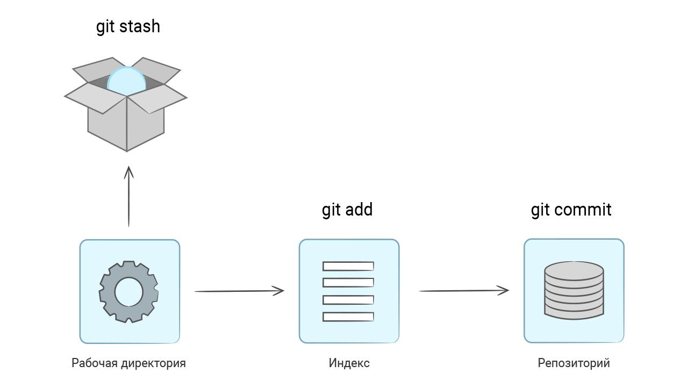

Представьте себе ситуацию. Вы работаете над какой-то важной задачей и исправили довольно много файлов. В этот момент появляется срочная задача — сделать какое-то изменение в исходном коде, не связанное с тем, над чем вы сейчас работаете. Ваши изменения еще не готовы, и они не должны попасть в репозиторий. Что делать? В этом уроке мы разберем команду, которая поможет в этом случае.

В самом простом случае, ваши изменения не пересекаются с изменениями по срочной задаче. В таком случае вы можете внести исправления, добавить их в индекс, закоммитить и запушить. Но обычно это неудобно и не всегда возможно. А если изменения нужно делать в тех файлах, с которыми вы работаете прямо сейчас?

Подобная ситуация у опытных разработчиков встречается регулярно. К счастью, она легко решается. В Git существует набор команд, позволяющий прятать изменения в рабочей директории и восстанавливать их при необходимости. Попробуем:
```bash
touch FILE.md
git add FILE.md
git status

On branch main
Your branch is up to date with 'origin/main'.

Changes to be committed:
  (use "git restore --staged <file>..." to unstage)
    new file:   FILE.md

# Прячем файлы
# После этой команды пропадут все измененные файлы
# независимо от того, добавлены они в индекс или нет
git stash

Saved working directory and index state WIP on main: e7bb5e5 update README.md

git status

On branch main
Your branch is up to date with 'origin/main'.

nothing to commit, working tree clean
```

Команда ``git stash`` не удаляет файлы. Они попадают в специальное место внутри директории .git на временное хранение. Эта команда не трогает новые файлы, так как они еще не являются частью репозитория:


После выполнения всех нужных изменений в чистой рабочей директории можно вернуть спрятанные изменения с помощью команды ```git stash pop```:
```bash
# Восстанавливаем
git stash pop

On branch main
Your branch is up to date with 'origin/main'.

Changes to be committed:
  (use "git restore --staged <file>..." to unstage)
    new file:   FILE.md

Dropped refs/stash@{0} (b896d4a0126ef4409ede63857e5d996953fe75c5)

# Проверяем
git status

On branch main
Your branch is up to date with 'origin/main'.

Changes to be committed:
  (use "git restore --staged <file>..." to unstage)
    new file:   FILE.md
```
Файлы вернулись в том виде, в котором они попали в стэш (stash).

Стэш в Git работает по принципу стека. Он позволяет сохранить внутрь любое количество изменений и восстановить их в обратном порядке:
```bash
git stash

# Изменяем файлы
git stash

# Возвращаем последние изменения
git stash pop

# Возвращаем предпоследние изменения
git stash pop
```


